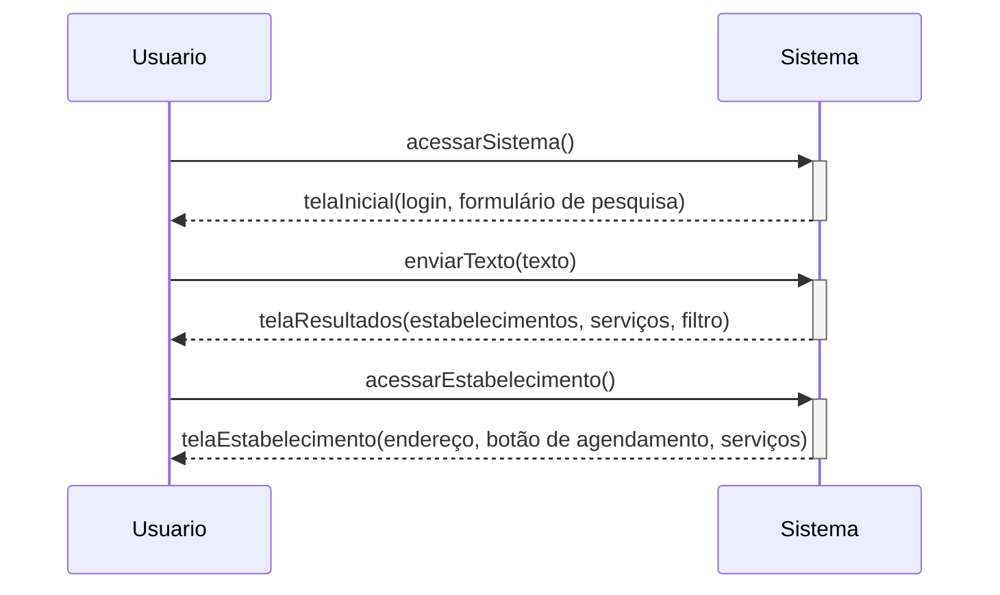

# Acessar Estabelecimento
## Descrição
Na lista de resultado de pesquisa o usuário acessa um estabelecimento.
 
## Atores
- Visitante
  - Humano
  - Primário
  - Ativo
- Cliente
  - Humano
  - Primário
  - Ativo
- Estabelecimento
  - Não humano
  - Secundário
  - Passivo
 
## Gatilhos
Não se aplica
 
## Pré-condições
Não se aplica
 
## Pós-condições
- A página de detalhes do estabelecimento é mostrada na tela
 
## Fluxo Principal
_Após o caso [`BuscarEstabelecimentoServico`](./buscarEstabeleciemntoServico.md)_
 
1. O usuário acessa a página de um estabelecimento do resultado da pesquisa.
 
_**Ponto de extensão:**_
[`Acessar Serviço`](./acessarServico.md)
 
### Página de histórico
1. A partir da página de histórico o usuário pode acessar o estabelecimento.
 
### Página de serviço
1. A partir da página de serviço o usuário pode acessar o estabelecimento.
 
## Regra de negócio
Acesso a página do estabelecimento.
 
## Diagrama

_[`voltar para documento de visão`](../README.md)_
