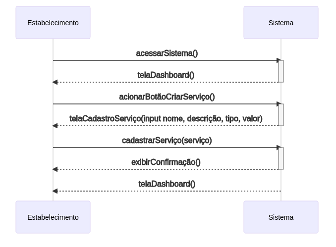

# Cadastrar Serviços
## Descrição
O estabelecimento cria um novo serviço no sistema e adiciona informações sobre ele.

## Atores
- Estabelecimento
  - Humano;
  - Principal;
  - Ativo;

## Gatilhos
Não se aplica.

## Pré-condições
- Estar autenticado.

## Pós-condições
- Ter um novo serviço cadastrado no sistema.

## Fluxo Principal
_Após o caso de uso [`AcessarDashboard`](./acessarDashboard.md)_

1. O estabelecimento aciona um botão para criar um novo serviço;
1. O sistema mostra um formulário contendo campo de nome do serviço, descrição, valor e tipo do serviço;
1. O estabelecimento envia as informações preenchidas no formulário;
1. O sistema exibe uma mensagem de confirmação de cadastro de serviço;
1. Um novo serviço é criado e o usuário é redirecionado para a dashboard;

## Fluxos Alternativos
Não se aplica.

## Situações de Erro
_**Dados requeridos não preenchidos**_

Consequência: O usuário pode desistir de cadastrar serviço.

## Regras de Negócio
O estabelecimento cadastra um serviço ofertado por ele.

## Diagrama

_[`voltar para documento de visão`](../README.md)_
