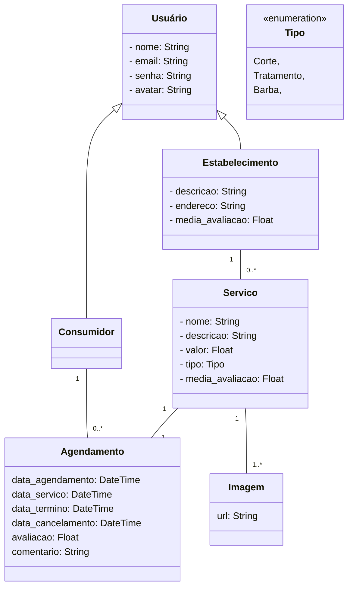

```mermaid
classDiagram
  Usuário <|-- Consumidor
  Usuário <|-- Estabelecimento
  Consumidor "1" -- "0..*" Agendamento
  Estabelecimento "1" -- "0..*" Servico
  Servico "1" -- "1" Agendamento
  Servico "1" -- "1..*" Imagem
  class Usuário {
    - nome: String
    - email: String
    - senha: String
    - avatar: String
  }
  class Consumidor {
  }
  class Estabelecimento {
    - descricao: String
    - endereco: String
    - media_avaliacao: Float
  }
  class Servico {
    - nome: String
    - descricao: String
    - valor: Float
    - tipo: Tipo
    - media_avaliacao: Float
  }
  class Tipo {
    <<enumeration>>
    Corte,
    Tratamento,
    Barba,
  }
  class Imagem {
    url: String
  }
  class Agendamento {
    data_agendamento: DateTime
    data_servico: DateTime
    data_termino: DateTime
    data_cancelamento: DateTime
    avaliacao: Float
    comentario: String
  }
```
